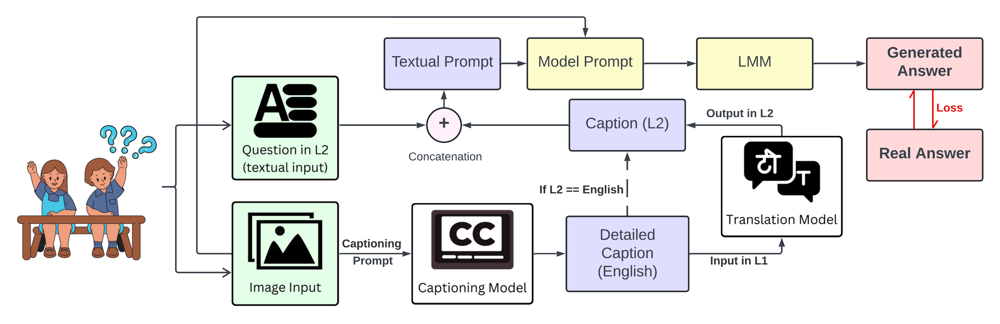

# Enhancing Scientific Visual Question Answering via Vision-Caption aware Supervised Fine-Tuning

---

## 📘 Overview

This work focuses on improving **Scientific Visual Question Answering (SciVQA)** by incorporating **Vision-Caption aware Supervised Fine-Tuning (VCASFT)**. This approach leverages both visual and caption information from scientific figures to enhance reasoning and answer generation.


## 🧩 Framework

The proposed VCASFT framework integrates caption along with visual features during fine-tuning, enriching the model’s understanding of scientific figures and textual annotations.

<p align="center">  </p>


## 🚀 Key Highlights

✅ **HiSciVQA Dataset** - A high-quality Multimodal Hindi Physics Question Answering Dataset

✅ **VCASFT** - A novel training paradigm that jointly leverages visual and caption information to improve reasoning in scientific VQA.

✅ **Performance Gains** - VCASFT Demonstrates substantial gains on HiSciVQA benchmarks across reasoning and answer quality metrics.

## 📂 HiSciVQA Dataset

### Data Files

```
data/
├── HiSciVQA_Train_Data.json
└── HiSciVQA_Test_Data.json

```
### Images

```
images/
├── train_images.zip
└── test_images.zip

```

## 📬 Contact

For any questions or feedback, please feel free to reach out:

**Janak Kapuriya**
kapuriya22032@iiitd.ac.in


## 📑 Citation

If you use this dataset or build upon this work, please cite:

```
@inproceedings{kapuriya2025enhancing,
  title={Enhancing Scientific Visual Question Answering via Vision-Caption aware Supervised Fine-Tuning},
  author={Kapuriya, Janak and Shaikh, Anwar and Goel, Arnav and Hira, Medha and Singh, Apoorv and Saraf, Jay and Sanjana and Nauriyal, Vaibhav and Anand, Avinash and Wang, Zhengkui and others},
  booktitle={Proceedings of the 2nd International Workshop on Large Vision-Language Model Learning and Applications},
  pages={13--30},
  year={2025}
}
```
